# WAPH-Web Application Programming and Hacking

## Instructor: Dr. Phu Phung

## Student

**Name**: Gali Sai Divakar Reddy

**Email**: galisy@mail.uc.edu


## Repository Information

Respository's URL: [https://github.com/Sai-Divakar-Reddy-Gali/waph-galisy.git](https://github.com/Sai-Divakar-Reddy-Gali/waph-galisy.git)

This is a private repository for Divakar to store all code from the course. The organization of this repository is as follows.

## The lab's overview

In Lab 1, we will delve into the intricacies of the HTTP protocol and web application programming through a two-part exploration. Part I focuses on gaining familiarity with Wireshark for HTTP traffic analysis and using telnet to interact with HTTP servers hands-on. The objective is to understand HTTP components, methods, and responses. In Part II, the focus shifts to web application programming, introducing the Common Gateway Interface (CGI) and implementing a simple web application in C, featuring user input processing. Additionally, we will explore web application programming using PHP, emphasizing the distinctions between HTTP GET and POST requests and the associated security considerations. This comprehensive lab aims to provide us with a practical understanding of HTTP, CGI, and basic web application development.

Here is the link to the Github repository
[https://github.com/Sai-Divakar-Reddy-Gali/waph-galisy/tree/main/labs/lab1](https://github.com/Sai-Divakar-Reddy-Gali/waph-galisy/tree/main/labs/lab1).

## Part I - The WEB and HTTP Protocol

### Task 1 - Familiar with the Wireshark tool and HTTP protocol

Wireshark is a powerful tool for examining the HTTP protocol, providing a detailed insight into the communication between clients and servers. To use Wireshark effectively, start by selecting the network interface through which the HTTP traffic is expected. Once the capture is initiated, navigate to the display filter and enter "http" to filter out HTTP-related packets. Analyze the captured packets to comprehend the request-response cycle, examining headers, methods, and content.


### Task 2 - Understanding HTTP using telnet and Wireshark

Using the telnet program to send a minimal HTTP request involves opening a terminal and establishing a connection to the target server on port 80. After the connection is established, manually craft a basic HTTP request by specifying the HTTP method (e.g., GET), the resource path, and the HTTP version. Press "Enter" twice to send the request. To examine the HTTP messages using Wireshark, initiate a capture on the relevant network interface and apply a display filter for "http" to focus on HTTP traffic. The Wireshark output will display the details of the sent HTTP request, including headers and data.

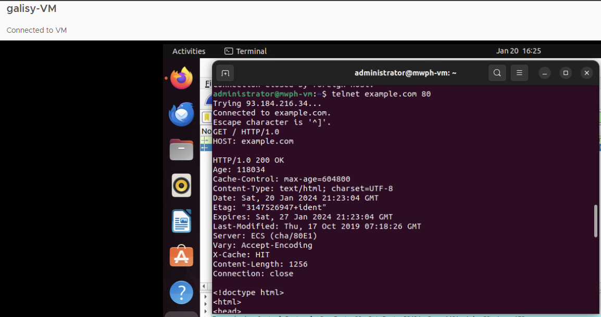

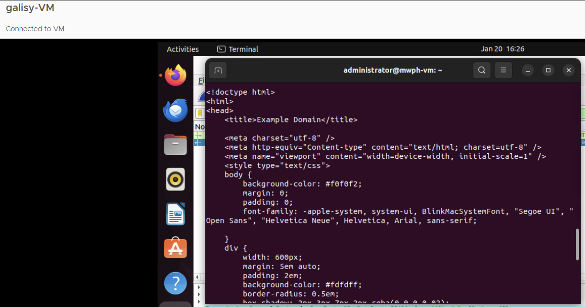

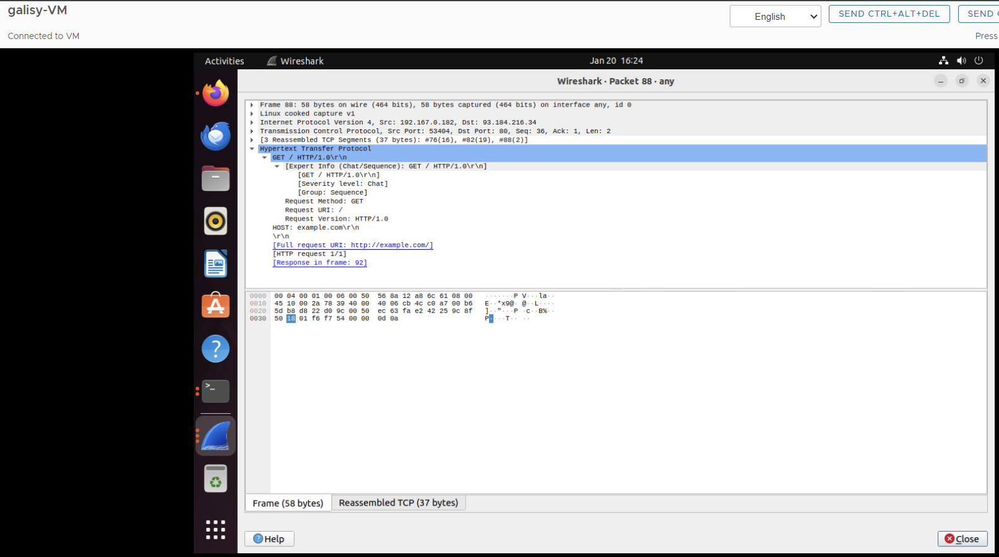

The HTTP request sent by a browser is typically more intricate, containing various headers, cookies, compression preferences, and session-specific information. It includes details like the user agent, accepted content types, and referral information. In contrast, a Telnet session involves a more simplified approach, often omitting many of these details. Telnet users may manually construct a basic request without the convenience features provided by browsers, such as automatic inclusion of cookies, compression preferences, and comprehensive headers.

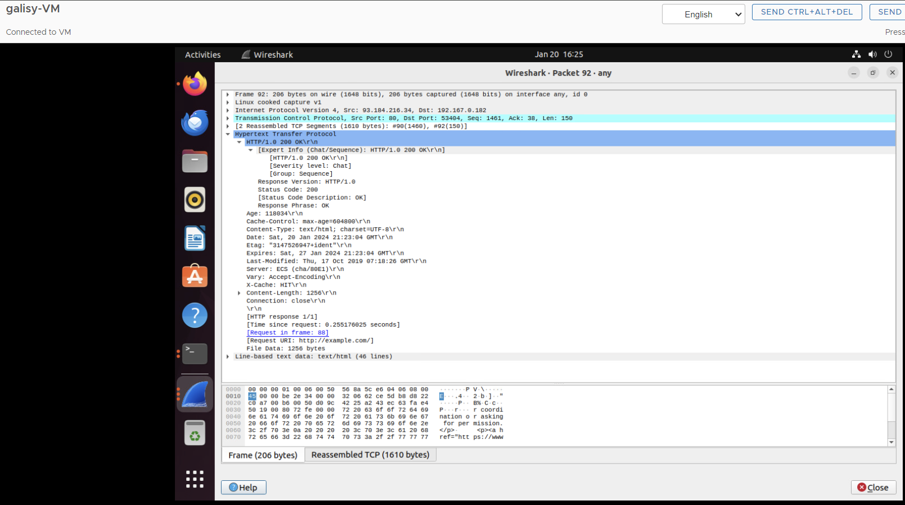

The HTTP response sent by a browser and a Telnet session differs in terms of complexity and the amount of information included. When a browser receives an HTTP response from a server, it processes a detailed set of headers and content, including status codes, content types, cookies, and caching directives. In contrast, a Telnet session may involve a more manual and simplified process, often lacking various headers and details found in browser-generated responses. Fields that could be missing in a Telnet session include specific headers like `Set-Cookie` for managing cookies, `Content-Encoding` for compression information, and other nuanced details related to caching and content negotiation. The browser response is more comprehensive, providing additional metadata and facilitating a seamless interaction with web applications.


## Part II - Basic Application Programming

### Task 1 - CGI Web applications in C

1. Developing a Hello World CGI program in C involves creating a C source code file `helloworld.c` that includes the necessary CGI headers and outputs the HTTP Content-Type header followed by the HTML content. Compile the C program using a C compiler, such as GCC, to generate an executable file `helloworld.cgi`. Once compiled, move the executable to the web server's CGI directory `/usr/lib/cgi-bin/`. On the web server, configure CGI execution, specifying the CGI directory in the server configuration. Access the CGI program through a web browser by navigating to the appropriate URL `http://localhost/cgi-bin/helloworld.cgi`. The web server will execute the CGI program, and the browser will display the output. This simple process demonstrates the compilation and deployment of a basic CGI program in C on a web server, allowing for dynamic content generation.

    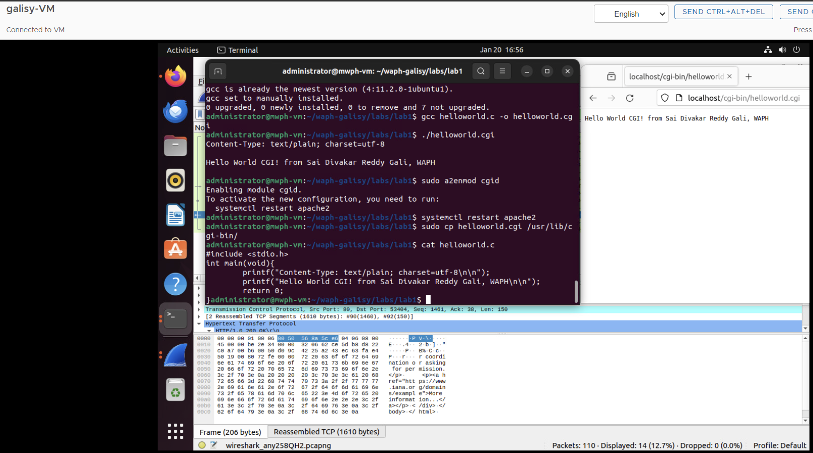

2. Developed a `index.c` file to demonstrate the skill to write C CGI program by following the simple HTML template with proper title, Heading, and paragraph.

    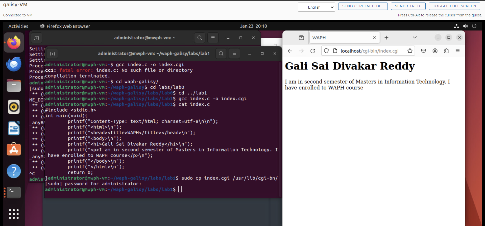

    Included file `index.c`:
    ```c
    #include <stdio.h>
    int main(void){
        printf("Content-Type: text/html; charset=utf-8\n\n");
        printf("<html>\n");
        printf("<head><title>WAPH</title></head>\n");
        printf("<body>\n");
        printf("<h1>Gali Sai Divakar Reddy</h1>\n");
        printf("<p>I am in second semester of Masters in Information technology. I have enrolled to WAPH course</p>\n");
        printf("</body>\n");
        printf("</html>\n");
        return 0;
    }
    ```

### Task 2 - A simple PHP Web Application with user input.

1. Create a PHP script with the "helloworld" content. Save it with a `helloworld.php` extension. Move the PHP script to the document root directory of the web server `/var/www/html/`. Open the web browser and navigate to the PHP script using the server's URL `http://localhost/helloworld.php`. The PHP script will be executed on the server, and the browser will display the output.

    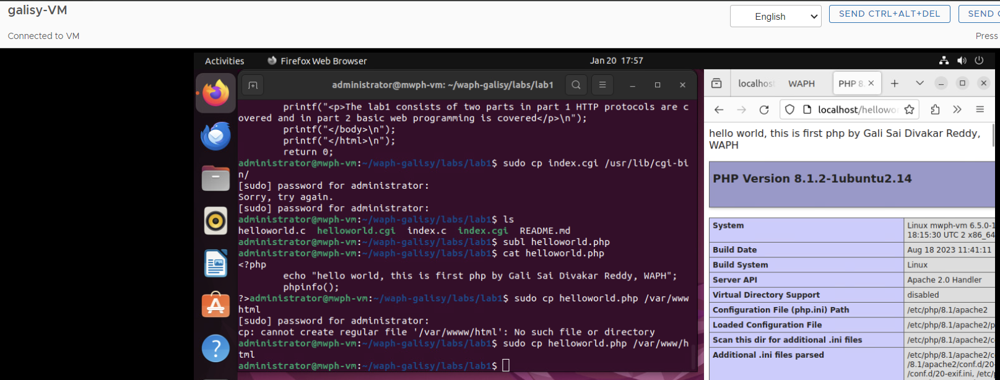

2. `echo.php` application

    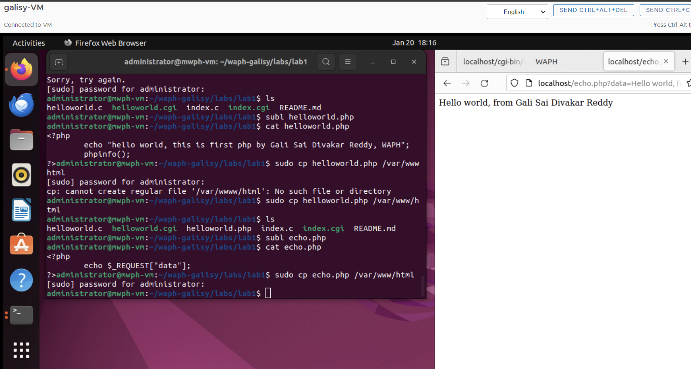

    Included file `echo.php`:
    ```php
    <?php
	echo $_REQUEST["data"];
    ?>
    ```
    Security Risks:

    - If the "data" parameter is populated with user input without proper validation or sanitization, it could be vulnerable to XSS attacks. An attacker might inject malicious scripts that get executed when the page is loaded by other users.
    - The use of `$_REQUEST` allows for data to come from various sources, including user input via URL parameters. This could lead to potential data tampering if the input is not validated or sanitized.


### Task 3 - Understanding HTTP GET and POST requests.

1. Start by selecting the network interface through which the HTTP traffic is expected in my case I selected `any` to capture the HTTP traffic. Open the web browser and navigate to the PHP script using the server's URL `http://localhost/echo.php?data=Hello%20world,%20from%20Gali%20Sai%20Divakar%20Reddy` Once the capture is initiated, navigate to the display filter and enter "http" to filter out HTTP-related packets. The below images demonstrates the Request and Response of the `echo.php` script

    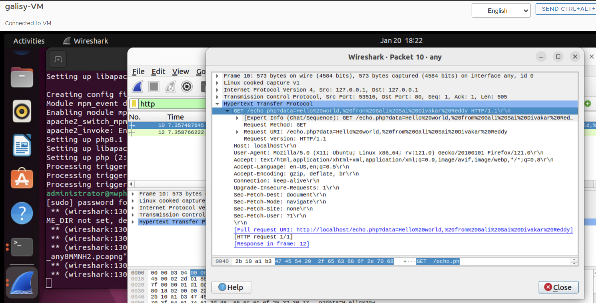

    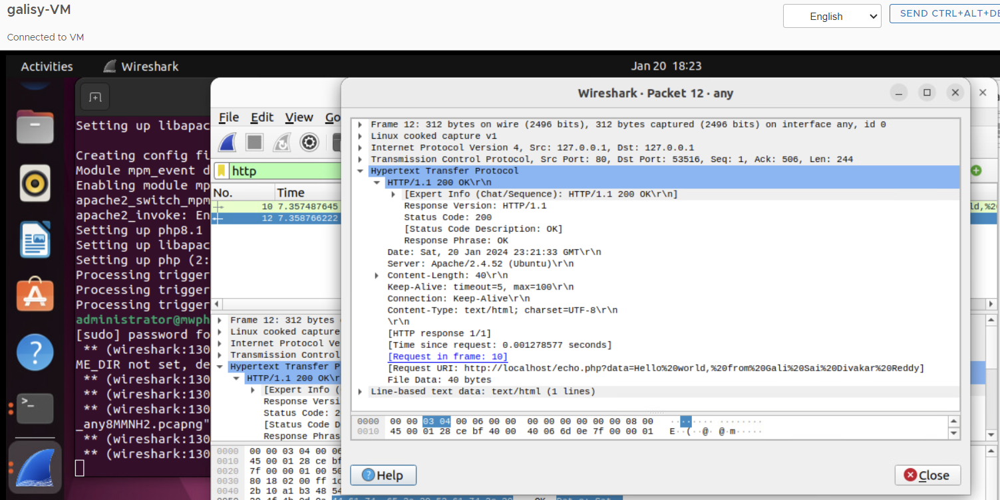

2. curl

    HTTP stream in Wireshark

    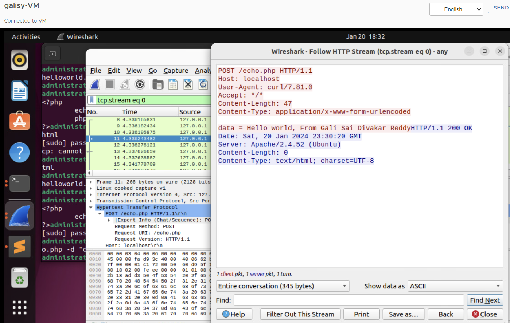

3. HTTP GET and POST requests are both methods used for communication between clients and servers. They share similarities in terms of using the HTTP protocol, containing headers, and specifying a Request URI. However, they differ in how data is submitted GET appends data to the URL, visible in the address bar, while POST sends data in the request body, making it more secure for sensitive information. GET has a size limit based on URL length, suitable for smaller data, while POST can handle larger amounts transmitted in the request body. GET requests can be cached, and their URLs can be bookmarked, whereas POST responses are typically not cached, and bookmarking is less common. Both responses include an HTTP status code indicating the outcome, but GET responses often include the requested data, while POST responses may serve as acknowledgments or include dynamic information.
