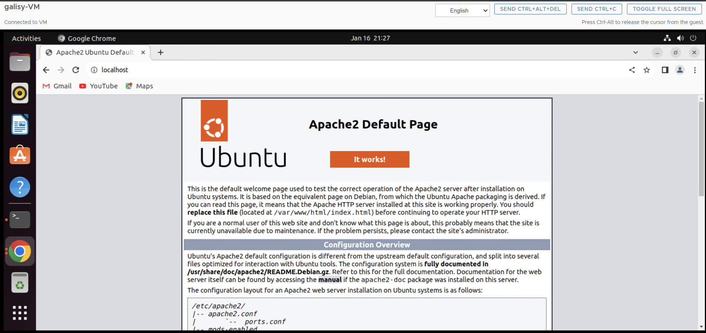
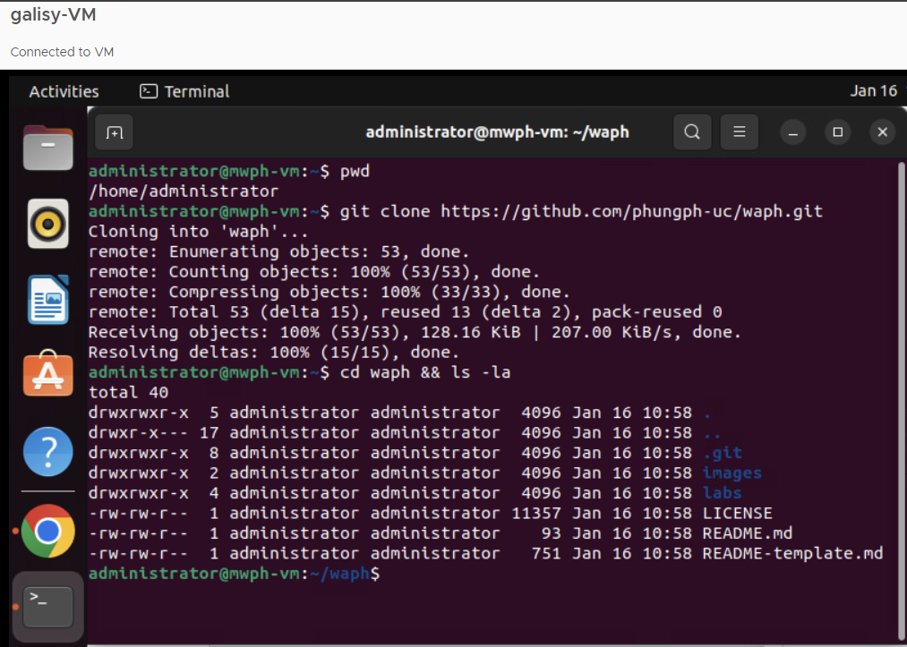
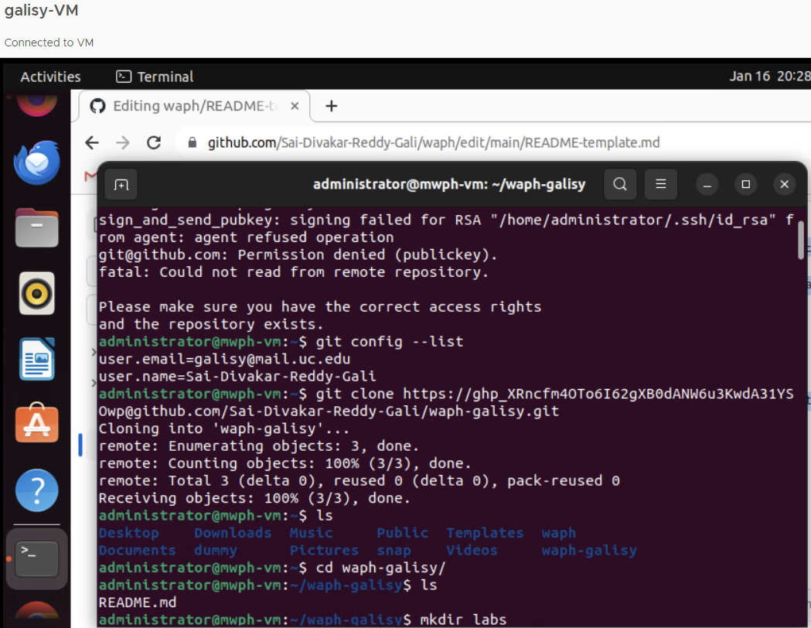
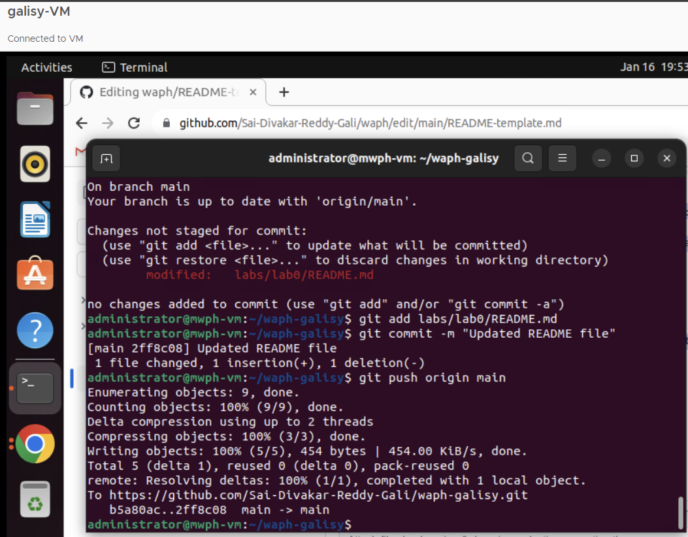

# WAPH-Web Application Programming and Hacking

## Instructor: Dr. Phu Phung

## Student

**Name**: Gali Sai Divakar Reddy

**Email**: galisy@mail.uc.edu

**Short-bio**: I am in my second semester of the MSIT, I have interest in web development. 

## Repository Information

Respository's URL: [https://github.com/Sai-Divakar-Reddy-Gali/waph-galisy.git](https://github.com/Sai-Divakar-Reddy-Gali/waph-galisy.git)

This is a private repository for Divakar to store all code from the course. The organization of this repository is as follows.

## The lab's overview

This lab, discussed in Lecture 2 with preparatory homework from Lecture 1, comprises two main parts. In Part I, the task involves deploying an Ubuntu 22.04 Virtual Machine within the designated online environment. Following the deployment, the focus is on installing necessary software and applications. Moving on to Part II, will engage in activities such as cloning both the course repository and the private repository. This step is pivotal for completing Git exercises aimed at compiling the content required for the final report.

Here is the link to the Github repository
[https://github.com/Sai-Divakar-Reddy-Gali/waph-galisy.git](https://github.com/Sai-Divakar-Reddy-Gali/waph-galisy.git).

## Part I - Ubuntu Virtual Machine & Software Installation

Certainly! To begin, log in to the sandbox server using your UC credentials. Following this, submit a request under the relevant course name to deploy the virtual machine. Head to the "Deployments" tab and find your course page. Click on "Connect to remote Console" to access the virtual machine console. Use the instructor-provided password to log in. After successfully logging in, you'll find that the Ubuntu system is now ready for your use.

Upon successfully logging into Ubuntu, I utilized the command line to install several essential tools, including Apache 2, Git, Sublime Text editor, and Pandoc. Additionally, I downloaded Google Chrome using Mozilla Firefox and proceeded to install it on the system.

### Apache Web Server Testing

## Part II - git Repositories and Exercises

### The course repository

### Private Repository

- Once logged in, go to the GitHub profile by clicking on the profile picture at the top right corner of the GitHub interface.
- In profile, find the "Repositories" tab and click on it. This will take to a page displaying the repositories.
- On the repositories page, look for the green "New" button and click on it. This will initiate the process of creating a new repository.
- Enter a name for the repository.
- Select "Private" to make the repository accessible only to specified collaborators.
- Click the option to initialize the repository with a README file.
- add a .gitignore file to specify which files and directories should be ignored in the repository. You can also choose a license for your project.
- Click on the "Create repository" button to finalize the creation of your private repository.

I added the contributer to the private repository, By Going to the "Settings" tab of the repository, select "Manage access," and invited collaborator `phung-waph` by entering the GitHub usernames.

Here is the link to the Github repository
[https://github.com/Sai-Divakar-Reddy-Gali/waph-galisy.git](https://github.com/Sai-Divakar-Reddy-Gali/waph-galisy.git).

1. Generating SSH keys and adding SSH key to the Github
    Generate SSH keys using ssh-keygen, press Enter for default location, and set a passphraseif needed. Access the key files at "~/.ssh" with ls ~/.ssh and copy the public key content from "id_rsa.pub" to add to the GitHub account for remote repository manipulation.
2. Clonning Remote repository
   Using the SSH key, clone the remote GitHub repository onto our virtual machine. This ensures that we have a local copy of the repository to work with. I have encountered a authentication issue while cloning the repository using the SSH key so I have used the alternative approach to clone the repository by using the tokes. Reference: [Clone a Remote Repository](https://stackoverflow.com/questions/2505096/clone-a-private-repository-github)

   
   
3. Editing README file
    Open the README.md file in the cloned repository and made edits following the provided template and push the changes to the remote repository.

    
